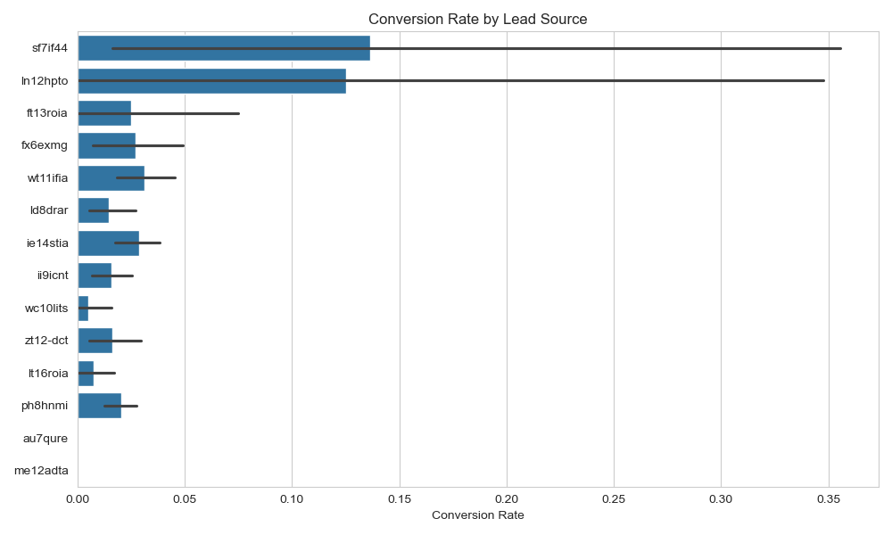
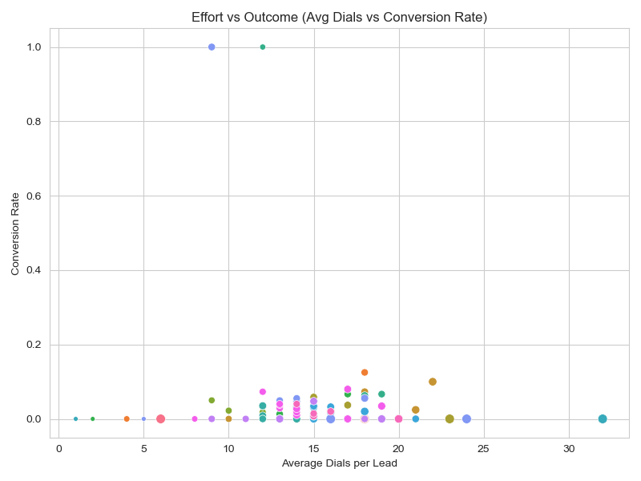
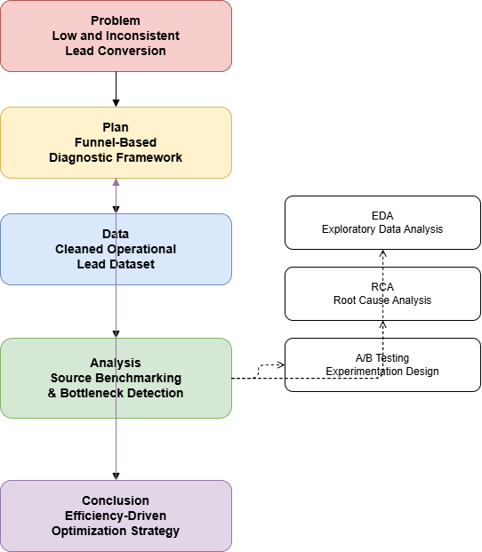

# 📈 Lead Conversion Process Optimization Analysis
## 👨‍💻 By Adejoro Raymond Olaotan

> A comprehensive, data-driven analysis of lead conversion performance using funnel analytics, engagement efficiency metrics, and experimentation design to optimize operational outcomes.

---

## 🧭 Project Overview

This project analyzes lead generation and conversion performance over a quarterly period to identify trends, inefficiencies, and bottlenecks within the lead conversion funnel.  
It delivers a **reproducible analytical framework** for evaluating lead sources, engagement strategies, and operational efficiency.

The project follows the **PPDAC framework**:
1. **Problem** : Identify inefficiencies and drop-offs in the lead conversion process  
2. **Plan** : Design a funnel-based analytical and optimization framework  
3. **Data** : Analyze real operational lead and engagement data  
4. **Analysis** : Evaluate performance, diagnose bottlenecks, and test hypotheses  
5. **Conclusion** : Recommend data-backed actions and experiments to improve conversion

---

## ⚙️ Methodology

### 🧩 **1. Problem Definition**
Despite high lead volume, conversion performance remains low and inconsistent across lead sources.  
The challenge is to improve conversion rates **without increasing agent workload or cost**, by identifying quality signals and operational inefficiencies.

---

### 🧠 **2. Plan & Design**
The analytical workflow was structured using the **PPDAC methodology**, ensuring traceability from business problem to recommendations.

Key design stages include:
- Data preparation and metric engineering
- Funnel and trend analysis
- Engagement effectiveness evaluation
- Root cause analysis (RCA)
- Recommendation prioritization and experimentation design

---

### 📦 **3. Data Preparation (ETL Process)**

- **Extract:** Lead-level operational data from Excel source  
- **Transform:**  
  - Removed aggregate rows  
  - Categorized missing carrier data as *Unknown*  
  - Engineered derived metrics (conversion rate, workable %, agent hours/conv)  
- **Load:** Prepared clean analytical tables for source and funnel comparison  

**Tools:** `pandas`, `numpy`, `Excel Pivot Tables`

---

### 🔍 **4. Exploratory & Funnel Analysis**

EDA and funnel analysis were conducted across core stages:

**Lead Posted → Workable → Approved Conversion**

**Analysis Goals:**
- Identify top and bottom-performing lead sources
- Detect major funnel drop-off points
- Evaluate diminishing returns from over-engagement
- Compare efficiency across sources using agent hours per conversion

**Key Observations:**
- Conversion efficiency varies widely across lead sources
- High-performing sources convert earlier with fewer dials
- Low-quality sources consume disproportionate agent effort

---

### 🤖 **5. Performance Evaluation & Benchmarking**

Lead sources were evaluated using the following metrics:

| Lead Source | Volume | Conversion Rate | Agent Hrs / Conv | Performance |
|------------|--------|-----------------|------------------|-------------|
| sf7if44 | 3,530 | 2.27% | 2.19 | ⭐ Star Performer |
| fx6exmg | 535 | 2.06% | 1.56 | 💎 Hidden Gem |
| ie14stia | 7,973 | 1.81% | 2.99 | Solid Performer |
| wt11ifia | 9,865 | 1.64% | 4.95 | ⚠ High Cost |
| ld8drar | 3,859 | 0.88% | 3.28 | Underperformer |
| lt16roia | 933 | 0.54% | 3.00 | ❌ Critical Concern |

**Evaluation Metrics Used:**
- Conversion Rate
- Workable Rate
- Average Dials per Lead
- Agent Hours per Conversion (Efficiency Proxy)

---

## 📊 Key Results & Discussion

### ✅ Summary
- Overall conversion performance is driven primarily by **lead quality and early engagement**
- sf7if44 and fx6exmg deliver the highest efficiency and scalability
- wt11ifia generates volume but at a high operational cost
- The largest funnel loss occurs **before leads become workable**

---

### 💡 Key Funnel Bottlenecks

#### 🔻 Contact Rate Bottleneck
- fx6exmg shows a **48% close rate** once contacted
- Poor contact rate (28%) limits overall conversions

#### 🔻 Closing Rate Bottleneck
- ii9icnt has strong contact rates but poor closing performance
- Indicates expectation mismatch or poor qualification

#### 🔻 Structural Disqualification
- Leads with “Other” carriers show significantly lower contact and conversion rates compared to major carriers

---

## 🖼️ Results Visualization Gallery

### 🔹 Lead Source Performance Comparison

  

### 🔹 Funnel Drop-Off Visualization

  

### 🔹 Engagement vs Conversion Efficiency

  

---

## 📈 Performance Dashboard Preview

The **Lead Conversion Performance Dashboard** provides a unified operational view of funnel health and efficiency metrics.

  

**Dashboard Features:**
- Conversion rate by lead source
- Agent hours per conversion
- Funnel drop-off visualization
- Engagement efficiency indicators

---

## 🧮 Workflow Flowchart

The workflow below illustrates the analytical pipeline used in this project, from problem definition to experimentation design.

  

**PPDAC Mapping:**
- **Problem:** Low and inconsistent lead conversion
- **Plan:** Funnel-based diagnostic framework
- **Data:** Cleaned operational lead dataset
- **Analysis:** Source benchmarking and bottleneck detection
- **Conclusion:** Efficiency-driven optimization strategy

---

## 🧠 Recommendations

### Strategic Recommendations
- Reallocate budget from **lt16roia** and **ld8drar** to **sf7if44** and **ie14stia**
- Scale **fx6exmg** despite lower volume due to superior efficiency
- Deprioritize leads with low-contact carriers

### Operational Recommendations
- Audit wt11ifia calls and tighten early qualification
- Align ii9icnt marketing messaging with actual offering
- Apply engagement limits based on lead quality tiers

---

## 🧪 Proposed A/B Tests & Experiments

| Experiment | Objective | Target Source | Method |
|-----------|----------|---------------|--------|
| SMS Warm-Up | Improve contact rate | fx6exmg | SMS before first call vs none |
| Aggressive Dialing | Salvage low conv source | lt16roia | 12 vs 20 dials over 3 days |
| Script Variation | Improve close rate | ii9icnt | Standard vs early qualification script |

---

## 🧠 Future Extensions

- Introduce predictive lead scoring models
- Integrate real-time dashboards using Power BI or Tableau
- Apply automated dial prioritization using engagement signals

---

## 📌 Final Takeaway

Lead conversion performance improves most when **early intent identification, engagement efficiency, and source prioritization** are optimized together.  
By focusing on quality-driven strategies and validating changes through controlled experiments, conversion outcomes can be improved while reducing operational waste.

---

📁 **Repository Structure**
- `/data` – Raw and cleaned datasets  
- `/analysis` – Metrics and funnel calculations  
- `/visuals` – Charts and dashboards  
- `/README.md` – Project documentation
